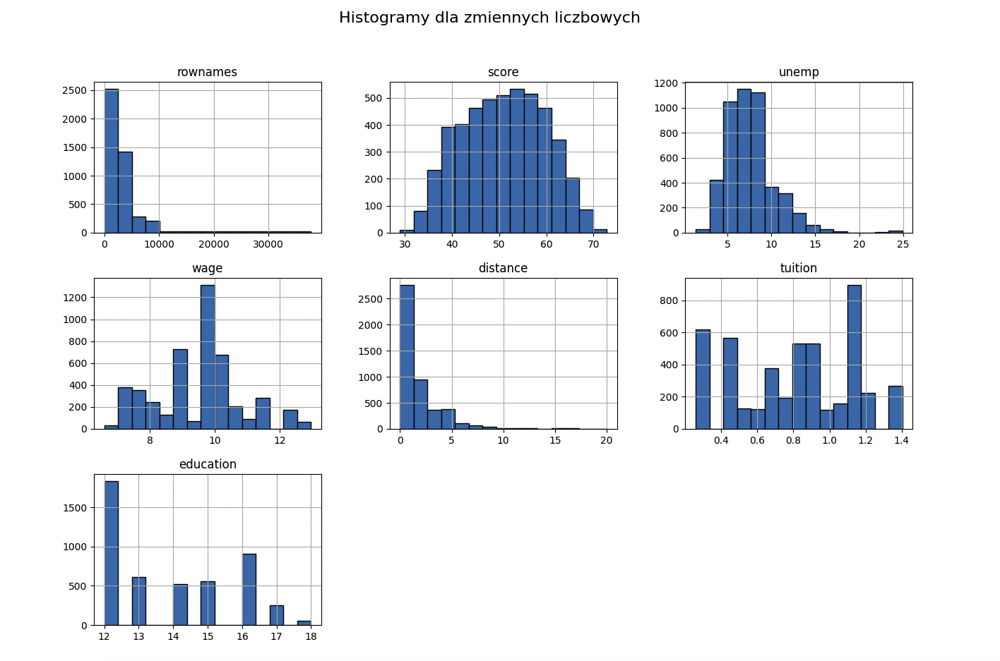
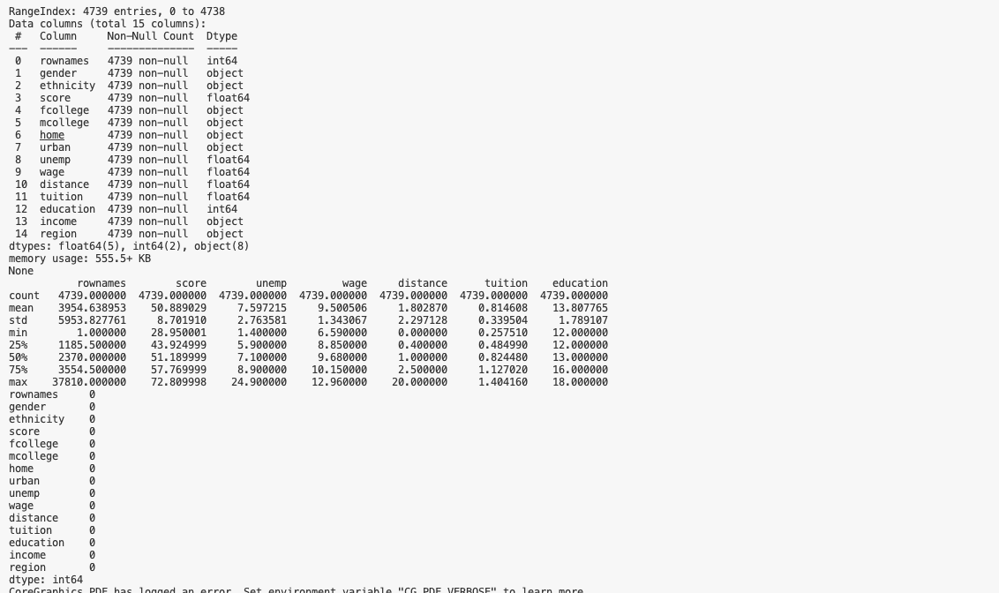

# Projekt Analizator Wyników

## Opis projektu
Celem projektu jest stworzenie modelu predykcyjnego, który na podstawie dostarczonego zbioru danych przewiduje zmienną `score`. Projekt obejmuje eksplorację danych, inżynierię cech, trenowanie i ocenę modelu.
## Analiza danych
   

Histogramy dla zmiennych liczbowych w zbiorze danych wskazują na różnorodność w wartościach oraz potencjalne niejednorodności w rozkładzie niektórych zmiennych. Ogólnie, wiele zmiennych wydaje się mieć wartości skoncentrowane w dolnym zakresie. W związku z tym jako jeden z algorytmów zastosowałem Random forest, który jest mniej wrazliwy na odstające wartości.

Zbiór danych zawiera 15 kolumn.
Wszystkie kolumny zawierają 4739 non-null wartości, co oznacza, że nie ma brakujących danych (null) w żadnej z kolumn.

## Wybór algorytmu
Przetestowane zostały trzy algorytmy dla podanych danych
- **Regresja liniowa**
MSE: 0.6478110558382555
MAE: 0.6610828223195607
R²: 0.3532577798594442
- **Gradient boosting wraz z odpowiednimi parametrami**
Best MSE: 0.6521370585366623
Best MAE: 0.6659013881128322
Best R2: 0.3489389147146045
- **Random forest wraz z odpowiednimi parametrami**
Best MSE: 0.6375852449270155
Best MAE: 0.6460359759252305
Best R²: 0.3634667190121037

Na podstawie porównania wyników trzech modeli regresyjnych, najlepszym algorytmem okazał się Random Forest.

MSE (Średni Błąd Kwadratowy) dla Random Forest wynosi 0.6376, co jest najniższą wartością spośród wszystkich modeli.
MAE (Średni Błąd Bezwzględny) również osiągnął wartość 0.6460, co wskazuje na mniejsze odchylenia prognozowanych wartości od rzeczywistych.
R² (Współczynnik Determinacji) wynosi 0.3635, co oznacza, że model Random Forest dobrze potrafi wychwycić róznice w danych

## Statystyki
   
